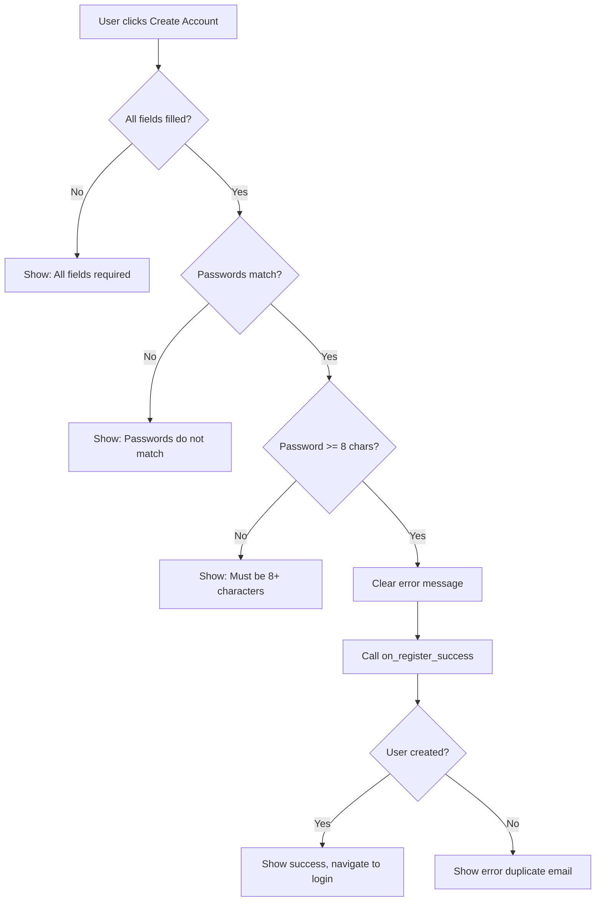

The register module provides a user registration interface for creating new library accounts with email/password authentication.

## register.create()

Creates a registration form with validation and callback handling for new account creation.

### Signature

```python
def create(
    on_register_success: Callable[[str, str, str, str], Awaitable[None]],
    on_back_to_login: Callable
) -> ui.element
```

### Parameters

<ParamField path="on_register_success" type="Callable[[str, str, str, str], Awaitable[None]]" required>
  Async callback function triggered when the user successfully submits the registration form.
  
  **Signature:**
  ```python
  async def on_register_success(
      name: str,
      email: str, 
      student_id: str,
      password: str
  ) -> None
  ```
  
  **Parameters:**
  - `name`: User's full name (trimmed)
  - `email`: Email address (trimmed)
  - `student_id`: Student ID number (trimmed)
  - `password`: Plain text password (not trimmed - preserves whitespace)
  
  **Expected behavior:**
  - Create user account in database
  - Hash password before storage
  - Show success notification
  - Navigate to login page or auto-login
  - Handle duplicate email errors
</ParamField>

<ParamField path="on_back_to_login" type="Callable" required>
  Callback function triggered when the user clicks the "Sign in" link at the bottom of the form.
  
  **Expected behavior:**
  - Navigate back to login page
  - Typically uses `ui.navigate.to('/')` or similar routing
</ParamField>

### Returns

<ResponseField name="container" type="ui.element">
  The root container element with class `login-outer scsu-bg`. Contains the entire registration UI with left branding panel and right form panel.
</ResponseField>

### UI Structure

Split-screen layout matching the login components:

**Left Panel (42% width)**
- SCSU logo (inverted/white)
- Blue accent divider
- "Department of Computer Science" label
- "CS Library Registration" heading
- Descriptive text: "Create an account to access the CS Library catalog."
- Copyright footer
- Diagonal stripe texture overlay

**Right Panel (58% width)**
- "Create Account" heading (3rem, bold)
- Blue accent bar
- Instructions: "Fill in your details to get started"
- **Five input fields:**
  1. Full Name (person icon, autofocus)
  2. Email Address (email icon, type=email)
  3. Student ID (badge icon)
  4. Password (lock icon, type=password)
  5. Confirm Password (lock_reset icon, type=password)
- **Error message label** (red, min-height 1rem)
- "Create Account" button with person_add icon
- **Back to login link**: "Already have an account? Sign in"
- Live clock display

### Form Validation

Client-side validation performed before calling `on_register_success`:

1. **Required fields check**: All fields must be non-empty
   - Error: "All fields are required."

2. **Password match check**: Password and Confirm Password must match
   - Error: "Passwords do not match."

3. **Password length check**: Minimum 8 characters
   - Error: "Password must be at least 8 characters."

Validation errors displayed in red error label above submit button.

### Internal Handler

The component includes an internal async handler that wraps `on_register_success`:

```python
async def _handle_register():
    name       = name_input.value.strip()
    email      = email_input.value.strip()
    student_id = student_id_input.value.strip()
    pwd        = password_input.value
    confirm    = confirm_input.value
    
    # Validation logic...
    
    error_label.text = ''  # Clear previous errors
    await on_register_success(name, email, student_id, pwd)
```

This handler is bound to:
- Enter key on confirm password field
- Click event on "Create Account" button

### Interactive Features

- **Autofocus**: Name input field has autofocus on page load
- **Enter key submission**: Pressing Enter on confirm password field submits the form
- **Password masking**: Password fields use `type=password` for secure input
- **Email validation**: Email field uses `type=email` for browser validation
- **Back link**: "Sign in" link triggers `on_back_to_login` callback

### Usage Example

<CodeGroup>
```python mainwebsite.py
from app import register
import database as db
from nicegui import ui

@ui.page('/register')
async def register_page():
    async def on_register(name: str, email: str, student_id: str, password: str):
        # Create user account
        user = await db.register_user(name, email, student_id, password)
        
        if user:
            ui.notify(
                f"Account created! Welcome, {user['name']}. Please sign in.",
                type='positive'
            )
            ui.navigate.to('/')  # Redirect to login
        else:
            # Email already exists
            ui.notify(
                'That email is already registered. Please sign in.',
                type='warning'
            )
    
    def back_to_login():
        ui.navigate.to('/')
    
    # Create registration UI
    register.create(
        on_register_success=on_register,
        on_back_to_login=back_to_login
    )
```

```python Database Integration
import bcrypt
from typing import Optional

async def register_user(
    name: str, 
    email: str, 
    student_id: str, 
    password: str
) -> Optional[dict]:
    """Create a new user account with hashed password."""
    
    # Check if email already exists
    existing = await get_user_by_email(email)
    if existing:
        return None  # Email already registered
    
    # Hash password
    salt = bcrypt.gensalt()
    hashed = bcrypt.hashpw(password.encode('utf-8'), salt)
    
    # Insert into database
    user = {
        'id': generate_user_id(),
        'name': name,
        'email': email,
        'student_id': student_id,
        'password_hash': hashed,
        'active': True,
        'created_at': datetime.now()
    }
    
    await db.users.insert(user)
    return user
```

```python Auto-Login After Registration
async def on_register(name: str, email: str, student_id: str, password: str):
    user = await db.register_user(name, email, student_id, password)
    
    if user:
        # Auto-login the new user
        current_user.update(user)
        user_name_label.text = user['name']
        
        ui.notify(f"Welcome, {user['name']}!", type='positive')
        
        # Show dashboard directly
        register_cont.visible = False
        app_header.visible = True
        dash_cont.visible = True
    else:
        ui.notify('Registration failed. Email may already exist.', type='negative')
```

```python Custom Validation
async def on_register(name: str, email: str, student_id: str, password: str):
    # Additional server-side validation
    if not email.endswith('@university.edu'):
        ui.notify('Please use your university email address.', type='warning')
        return
    
    if len(student_id) != 8 or not student_id.isdigit():
        ui.notify('Student ID must be 8 digits.', type='warning')
        return
    
    # Check password strength
    if not any(c.isupper() for c in password):
        ui.notify('Password must contain at least one uppercase letter.', type='warning')
        return
    
    # Proceed with registration
    user = await db.register_user(name, email, student_id, password)
    # ...
```
</CodeGroup>

## Validation Flow



## Styling

Matches the styling of `login.create()` and `login_email.create()`:

- **Theme**: Dark with `#0a1f44` blue left panel
- **Accent color**: `#3b82f6` (blue) with glow effects
- **Font**: Space Grotesk
- **Input styling**: NiceGUI `dark standout` props with `rgba(255,255,255,0.06)` background
- **Button styling**: Blue semi-transparent with border and hover glow

### Custom CSS Classes

Injected via `ui.add_head_html()`:

- `.login-outer`: Full viewport flex container
- `.left-panel`: 42% width branding panel
- `.right-panel`: Flexible form panel
- `.stripe-texture`: Diagonal stripe overlay
- `.back-link`: Blue underlined link with hover effect

## Common Patterns

### Email Domain Validation

```python
async def on_register(name: str, email: str, student_id: str, password: str):
    # Require specific email domain
    if not email.endswith('@scsu.edu'):
        ui.notify('Please use your SCSU email address.', type='warning')
        return
    
    await db.register_user(name, email, student_id, password)
```

### Student ID Format Validation

```python
import re

async def on_register(name: str, email: str, student_id: str, password: str):
    # Enforce 8-digit format
    if not re.match(r'^\d{8}$', student_id):
        ui.notify('Student ID must be exactly 8 digits.', type='warning')
        return
    
    await db.register_user(name, email, student_id, password)
```

### Password Strength Requirements

```python
import re

async def on_register(name: str, email: str, student_id: str, password: str):
    # Require uppercase, lowercase, digit, special char
    if not re.match(r'^(?=.*[a-z])(?=.*[A-Z])(?=.*\d)(?=.*[@$!%*?&])[A-Za-z\d@$!%*?&]{8,}$', password):
        ui.notify(
            'Password must contain uppercase, lowercase, digit, and special character.',
            type='warning'
        )
        return
    
    await db.register_user(name, email, student_id, password)
```

### Navigation Integration

```python
# In mainwebsite.py
@ui.page('/')
async def login_page():
    # Login UI that links to /register
    # (handled by login_email component)
    pass

@ui.page('/register')
async def register_page():
    register.create(
        on_register_success=handle_registration,
        on_back_to_login=lambda: ui.navigate.to('/')  # Return to login
    )
```

## Error Handling

The error label has a minimum height to prevent layout shifts:

```python
error_label = ui.label('').style(
    'color:#f87171; font-size:0.72rem; min-height:1rem; margin-bottom:0.4rem;'
)
```

Set error messages with:
```python
error_label.text = 'Error message here'
```

Clear errors with:
```python
error_label.text = ''
```

## See Also

- [Login Components](/api/ui/login) - Student ID and email/password login interfaces
- [Dashboard Component](/api/ui/dashboard) - Main application UI after registration
- [Database Module](/api/database/overview) - User account management functions